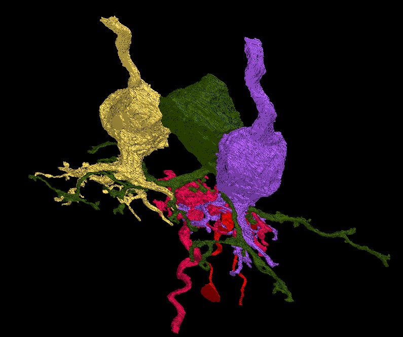

# CAST
An AI Based Segmentation Tool For TrakEM2 (Undergraduate Research Project)

The Computer Assisted Segmentation Tool (CAST) is a plugin for TrakEM2. Once it is installed CAST can be found in the TrakEM2 toolbar under the pencil icon. CAST uses a neural network and graph based algorithms to differentiate the inside area of a structure from the boundary. This provides the user with the ability to easily outline a given structure with only one click.

<a href="https://drive.google.com/drive/folders/1o7LqvCvP_JuPi44YXhPDBpOuyVziF_yF?usp=sharing" target="_blank">Practice Data</a>

